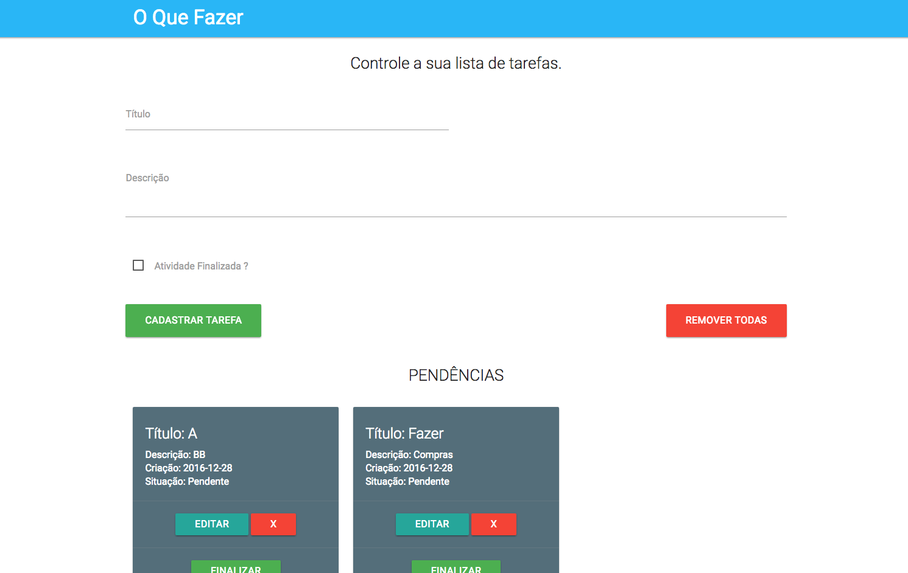

# Projeto para cadastro de atividades

### Importante

Este projeto é apenas um estudo de caso simples, que pode melhorar, eu foquei no essencial do projeto, cadastrar as atividades, mudar o status das mesmas, listar e excluir. Como melhorias futuras podem existir diálogos de confirmação nas ações de exclusão geral ou por atividade, opção de data com calendário, paginação etc.

### Dependências

0. PHP 5.7.x
0. Laravel 5.3.x
0. Materialize
0. JQuery
0. Angular JS 1.x

### Execute o projeto com o comando abaixo

0. git clone no projeto.

### Instalando bibliotecas com composer

0. instlae o composer [composer](https://getcomposer.org/)
0. entre no diretório root da aplicação `cd pasta_raiz_do_projeto`
0. execute `composer install`

### Para rodar alguns testes de view para a aplicação

0. entre no diretório root da aplicação `cd pasta_raiz_do_projeto`
0. execute `php artisan make:test`.

### Instalando bibliotecas do frontend com bower (nesse projeto estou utilizando o CDN)

0. instale o [bower](http://bower.io/)
0. entre no diretório root da aplicação `cd pasta_raiz_do_projeto` onde encontra-se o `bower.json`
0. execute `bower install`
0. após isso faça as alterações nos imports das libs que estão no template `templates/inicial.html`

### Para rodar a aplicação

0. entre no diretório root da aplicação `cd pasta_raiz_do_projeto`
0. execute `php artisan serve --host=0.0.0.0 --port=8180`.
0. acesso pelo navegado `http://0.0.0.0:8000` ou `http://IP_ATUAL:8000`.

### Tela inicial do Projeto

